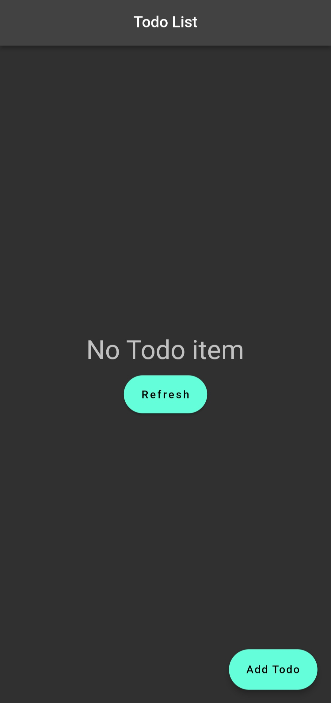
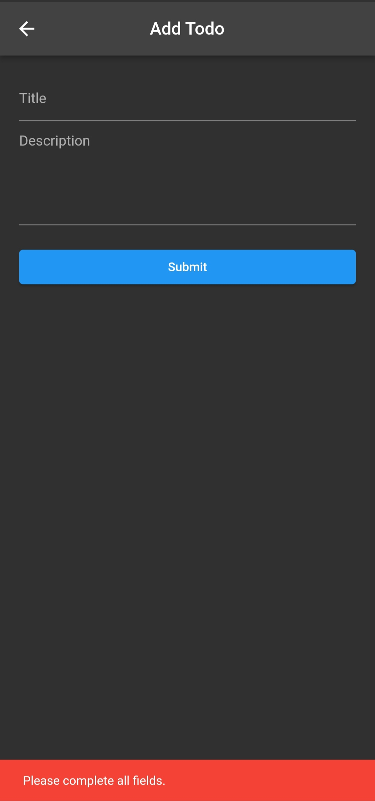
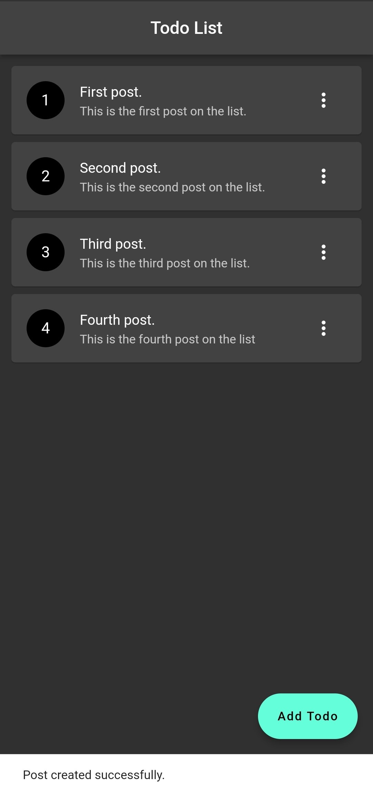
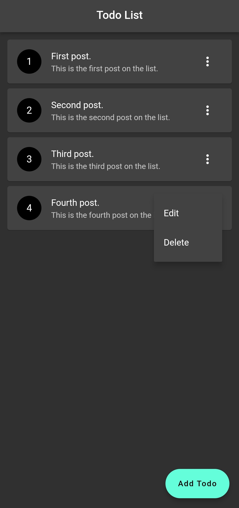
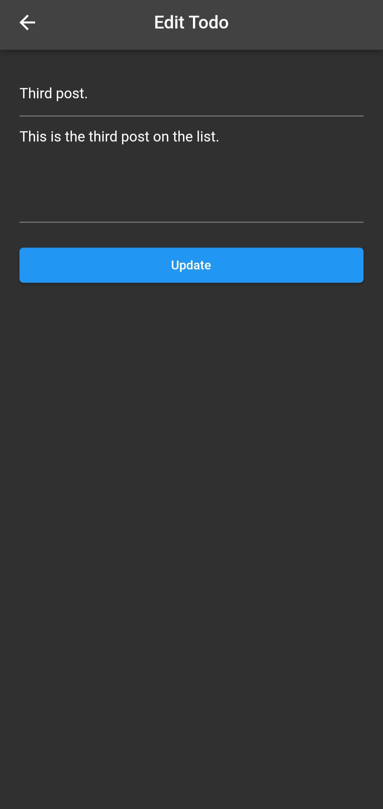
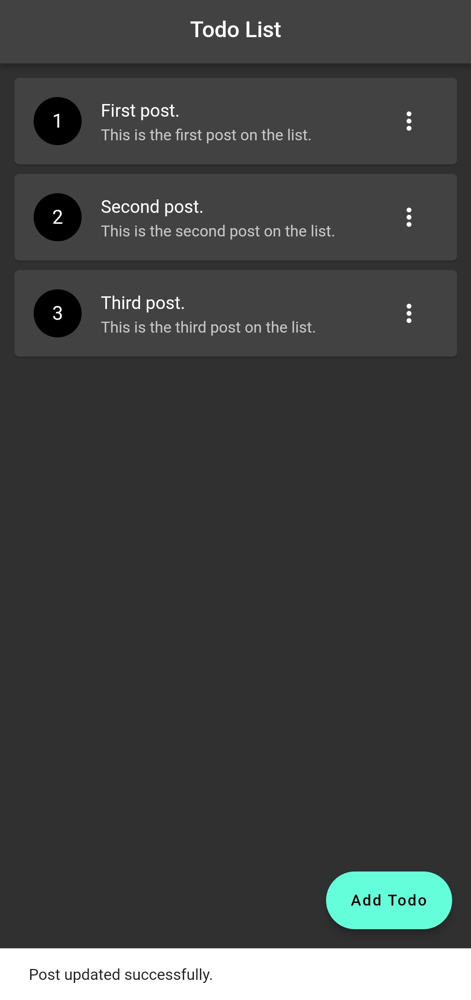
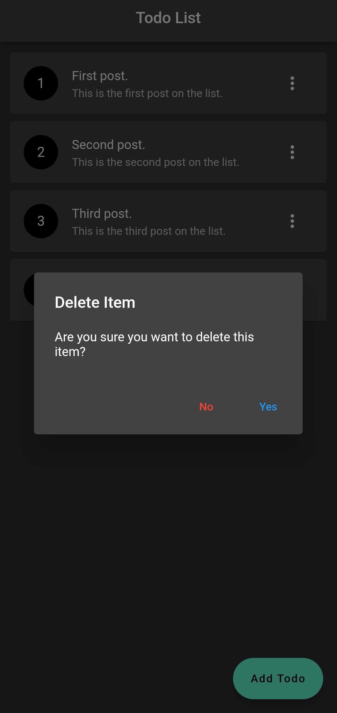
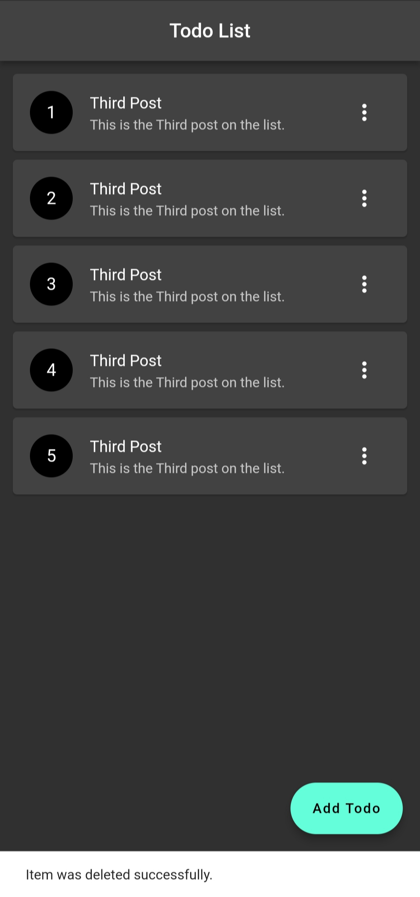

# Todo App

This repository contains a Flutter project that uses an API to fetch data and display it in the app. The app is built using the Flutter framework and the Dart programming language.

## Screenshots

 &nbsp; &nbsp;  &nbsp; &nbsp;  

&nbsp; &nbsp;  &nbsp; &nbsp; 

 &nbsp; &nbsp; 

## Getting Started

To get started with this project, follow these steps:

1. Clone the repository to your local machine using the command:
   `git clone https://github.com/GoldenOkey-Nwala/todo-app.git`
   &nbsp;
2. Open the project in your preferred IDE or text editor
   &nbsp;
3. Run flutter pub get to install the project dependencies
   &nbsp;
4. Run the app using `flutter run` command

## Features

- Fetching data from an API
- Displaying data in a list view
- Showing a detail view of each item in the list
- Pull-to-refresh to reload data from the API

## Dependencies

The project uses the following dependencies:

- [http](https://pub.dev/packages/http/example) - for making HTTP requests to the API

## Contributing

If you find any issues or have suggestions for improvement, feel free to create a pull request.

## Reference

The API used is a [free API.](https://api.nstack.in)
Some resources for this repo were gotten from the [Flutter REST API](https://youtu.be/Wsor0fci3Ss) youtube course by [Nitish Kumar Singh.](https://www.youtube.com/@NitishKumarSingh)
